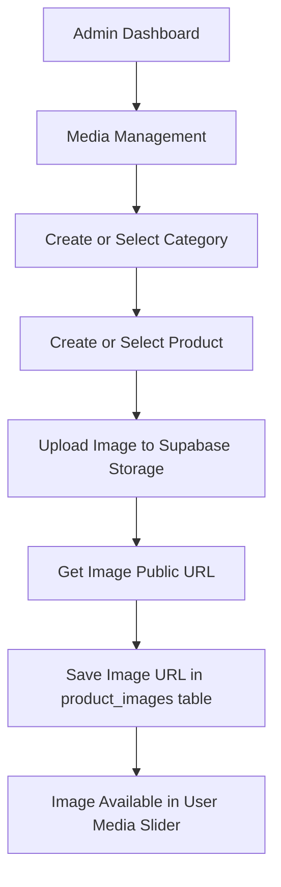

# Admin Media Management

```mermaid
flowchart TD
    A[Admin Dashboard] --> B[Media Management]

    B --> C[Create or Select Category]
    C --> D[Create or Select Product]

    D --> E[Upload Image to Supabase Storage]
    E --> F[Get Image Public URL]

    F --> G[Save Image URL in product_images table]

    G --> H[Image Available in User Media Slider]
```
