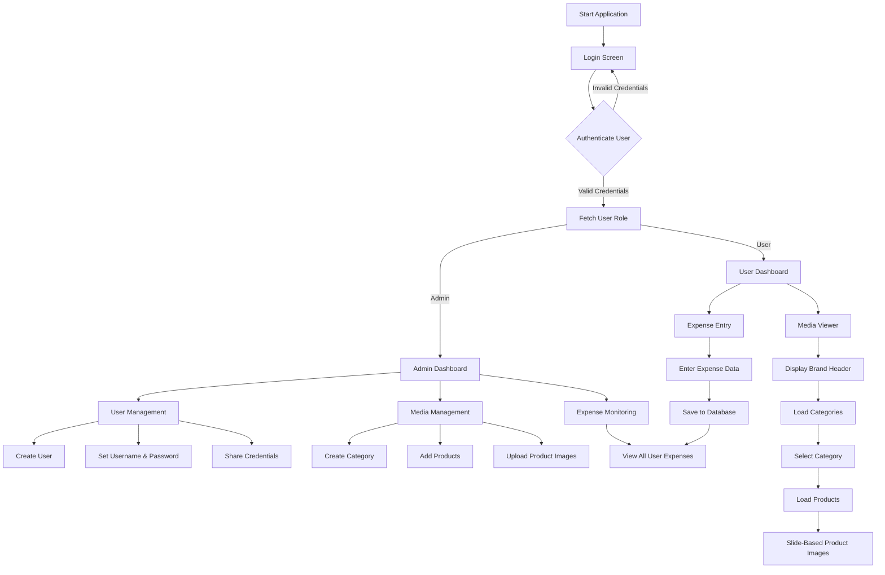

# Application Flowchart

```mermaid
flowchart TD
    A[Start Application] --> B[Login Screen]

    B --> C{Authenticate User}

    C -->|Invalid Credentials| B
    C -->|Valid Credentials| D[Fetch User Role]

    D -->|Admin| E[Admin Dashboard]
    D -->|User| F[User Dashboard]

    %% Admin Flow
    E --> E1[User Management]
    E --> E2[Media Management]
    E --> E3[Expense Monitoring]

    E1 --> E1a[Create User]
    E1 --> E1b[Set Username & Password]
    E1 --> E1c[Share Credentials]

    E2 --> E2a[Create Category]
    E2 --> E2b[Add Products]
    E2 --> E2c[Upload Product Images]

    E3 --> E3a[View All User Expenses]

    %% User Flow
    F --> F1[Media Viewer]
    F --> F2[Expense Entry]

    %% Media Viewer Flow
    F1 --> M1[Display Brand Header]
    M1 --> M2[Load Categories]
    M2 --> M3[Select Category]
    M3 --> M4[Load Products]
    M4 --> M5[Slide-Based Product Images]

    %% Expense Flow
    F2 --> X1[Enter Expense Data]
    X1 --> X2[Save to Database]
    X2 --> E3a
```
