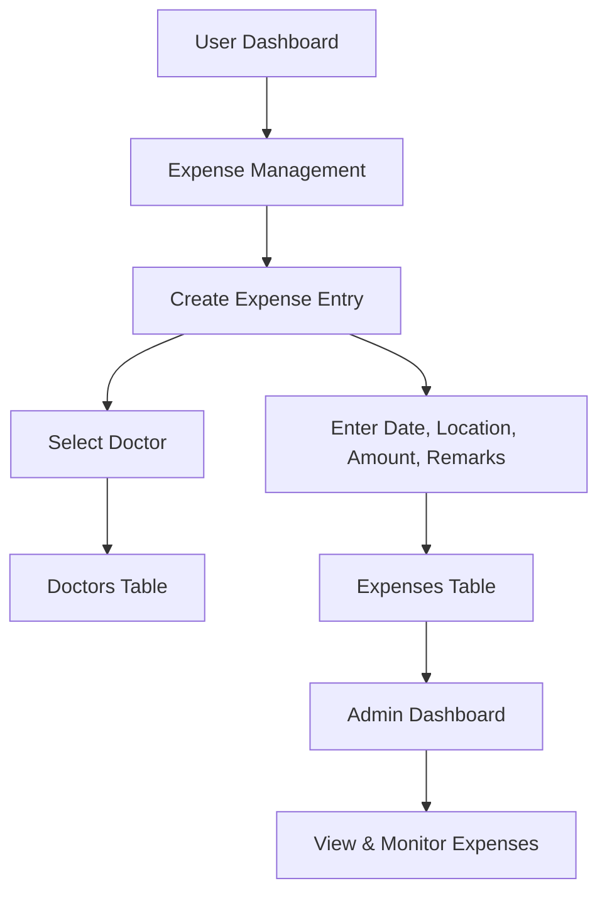

# Expense Management

```mermaid
flowchart TD
    A[User Dashboard] --> B[Expense Management]

    B --> C[Create Expense Entry]
    C --> D[Select Doctor]
    C --> E[Enter Date, Location, Amount, Remarks]

    D --> F[Doctors Table]
    E --> G[Expenses Table]

    G --> H[Admin Dashboard]
    H --> I[View & Monitor Expenses]
```
