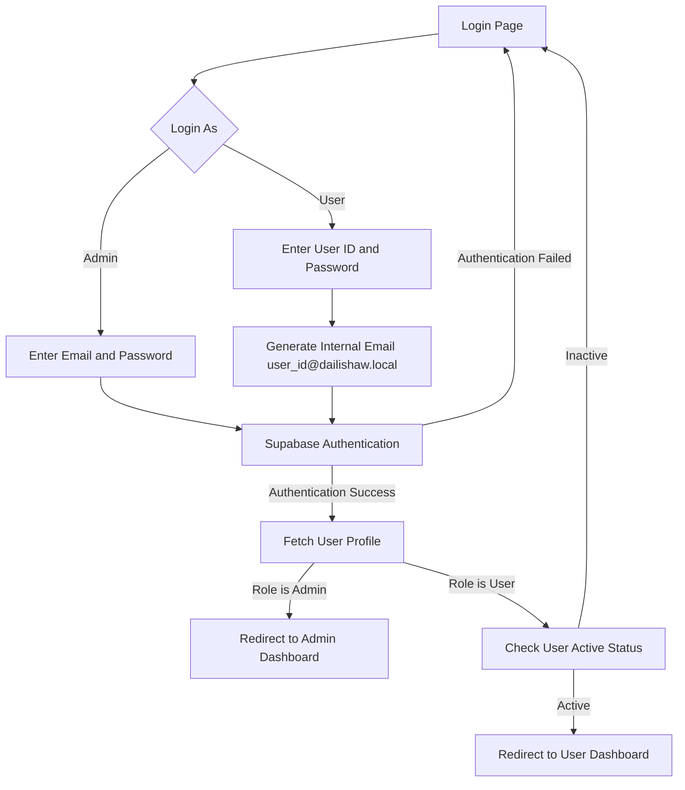

# Login Architecture

```mermaid
flowchart TD
    A[Login Page] --> B{Login As}

    B -->|Admin| C[Enter Email and Password]
    B -->|User| D[Enter User ID and Password]

    D --> D1[Generate Internal Email user_id@dailishaw.local]

    C --> E[Supabase Authentication]
    D1 --> E

    E -->|Authentication Failed| A
    E -->|Authentication Success| F[Fetch User Profile]

    F -->|Role is Admin| G[Redirect to Admin Dashboard]
    F -->|Role is User| H[Check User Active Status]

    H -->|Inactive| A
    H -->|Active| I[Redirect to User Dashboard]
```
